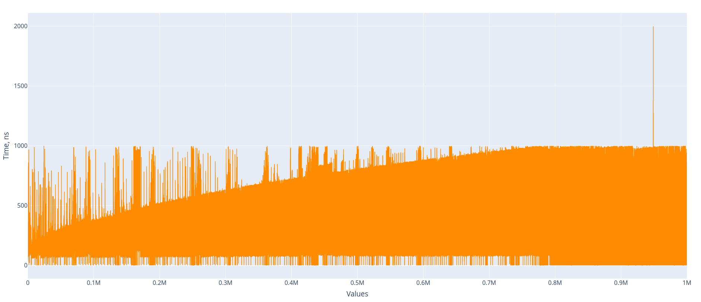

# Divisors
Very FAST code for finding divisors of a number (Rust, C++, Python)  

[](#)
[](#)

[](#)

## Manual
The first step: enter your number.  
The second step: the program will print all divisors.  

## Constrains
| Language | Constraints |
| --- | --- |
| Rust | 0 <= your number < 2<sup>128</sup> |
| C++ | 0 <= your number < 2<sup>64</sup> |
| Python | Any unsigned number (int) |

## Output Format
```bash
   This program returns divisors of a number.
   Enter the number:
   1234567890            # YOUR NUMBER
   ----------
   2 ^1                  # Divisor
   3 ^2                  # Divisor
   5 ^1                  # Divisor
   3607 ^1               # Divisor
   3803 ^1               # Divisor
   ----------
   Finished: 118.353µs   # Execution time
```
All divisors are PRIME NUMBERS (2, 3, 5, 3607, 3803).  
`3 ^2` - here `3` is a <ins>prime divisor</ins>, `^2` is a <ins>power</ins> (3<sup>2</sup> = 3 × 3).  
Indeed, 2 × 3<sup>2</sup> × 5 × 3607 × 3803 = 1234567890!

## Time Complexity


xaxis - values 0 to 1 000 000 (includes 0 because my program returns 0 here)  
yaxis - time duration, ns (nanoseconds)

The measurements based on the algorithm in the **Rust** language. The scatter was made by Plotly (Python)

You can take a closer look in the [scatter.html](scatter.html). Download it, because it's too big to be shown here.
